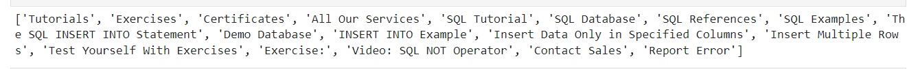
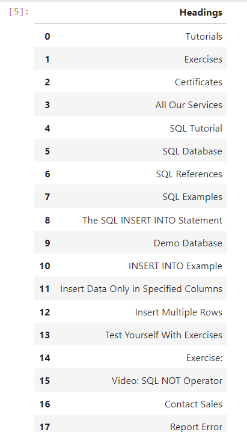

# Exno-2appds
**AIM:**
    
    To Perform Data Collection through web scraping using python.

**ALGORITHM:**

	Step 1: Include the Necessary python libraries.
 
	Step 2: Use the requests library to send HTTP requests to a web page.
 
	Step 3: Retrieve the HTML content and use BeautifulSoup to parse it.
 
	Step 4: Navigate and extract the necessary data.
 
	Step 5: Handle the Java script content and retrieve the data using the html tags.
 
	Step 6: Check with the website permission and scrap the content.

**PROGRAM:**

```
Developed by: Manoj Kumar S
Register no: 212221230056
```
### Importing necessary libraries:
```
import requests
from bs4 import BeautifulSoup
import pandas as pd	
```

### Fetching webpage:
```
url = 'https://www.w3schools.com/sql/sql_insert.asp'
response = requests.get(url)
response
```

### Parsing HTML and extracting headings
```
soup = BeautifulSoup(response.content, 'html.parser')
headings = soup.find_all('h2')
headlist=[x.text for x in headings]
print(headlist)
```

### Creating DataFrame and saving to CSV

```
df=pd.DataFrame(headlist,columns=['Headings'])
df.to_csv('newdata.csv', index=False)
df
```

#### OUTPUT: 

### Response Code:


### Heading Code:


### DataFrame:




**RESULT:**
 
Thus , data Collection through web scraping using python is successfully performed.